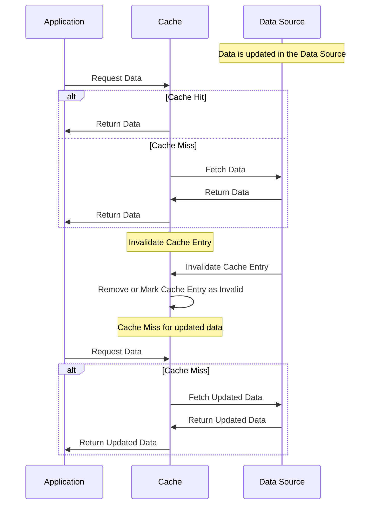
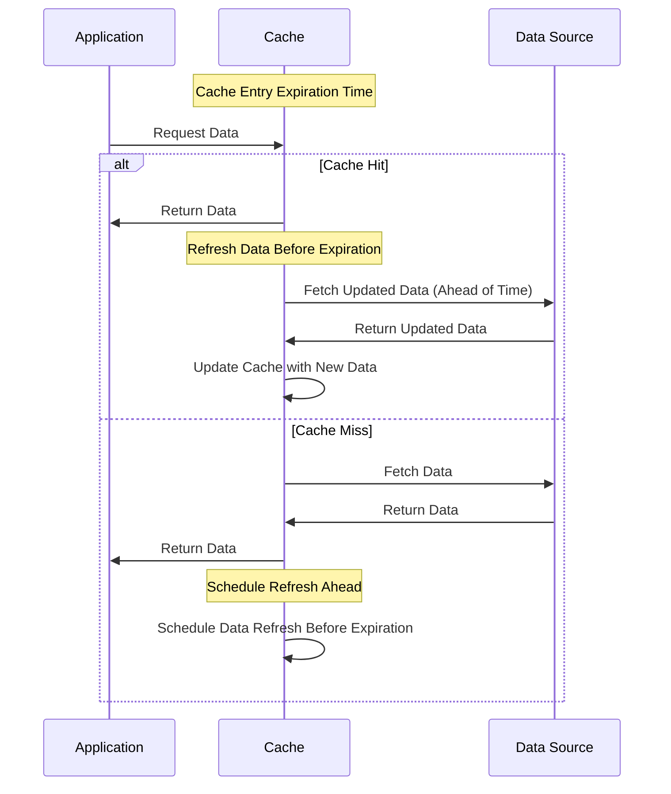
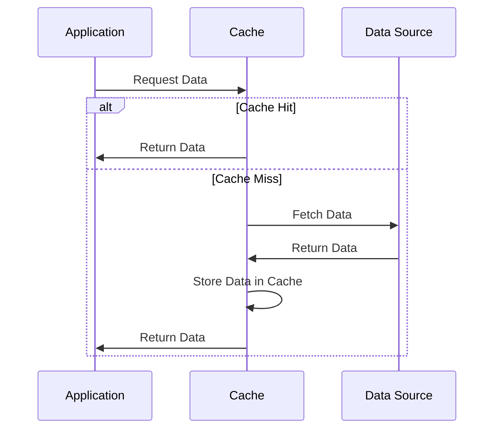

# Thiết kế  hệ thống cache

- [Thiết kế  hệ thống cache](#thiết-kế--hệ-thống-cache)
  - [Mục đích và yêu cầu](#mục-đích-và-yêu-cầu)
  - [Design pattner](#design-pattner)
    - [Cache-Aside (Lazy Loading) Pattern](#cache-aside-lazy-loading-pattern)
    - [Write-Through Pattern](#write-through-pattern)
    - [Write-Behind (Write-Back) Pattern](#write-behind-write-back-pattern)
    - [Cache Invalidation Pattern](#cache-invalidation-pattern)
    - [Refresh-Ahead Pattern](#refresh-ahead-pattern)
    - [Read-Through Pattern](#read-through-pattern)
  - [Thiết kế hệ thống với redis](#thiết-kế-hệ-thống-với-redis)

## Mục đích và yêu cầu

- Tăng tốc truy xuất dữ liệu bảng tham số.
- Đảm bảo dữ liệu trong cache và database luôn nhất quán.

## Design pattner

### Cache-Aside (Lazy Loading) Pattern
  
  Hệ thống sẽ tìm kiếm  trong bộ nhớ đệm, nếu trong bộ nhớ đệm không tồn tại hệ thống sẽ tìm kiếm trong bộ nhớ chính, lưu trữ vào bộ nhớ đệm sau đó trả cho người dùng.Phù hợp cho các dữ liệu ít thay đổi nhưng được truy cập thường xuyên.

  Ưu điểm

      Đạt hiệu suất cao do chỉ truy xuất database khi dữ liệu trong bộ nhớ đệm hết hạn.Giảm tải cho cơ sở dữ liệu gốc, tăng tốc truy xuất.

      Dễ dàng triển khai do ứng dụng kiểm soát toàn bộ quá trình đọc/ghi dữ liệu bộ đệm

  Nhược điểm

      Khi dữ liệu trong bộ đệm hết hạn , thời gian truy xuất dữ liệu sẽ chậm hơn do phải truy xuất vào database

      Không đảm bảo tính nhất quán vì dữ liệu trong bộ đệm và database không đồng bộ, chỉ khi dữ liệu trong bộ đệm hết hạn mới tiến hành truy xuất vào database để cập nhật lại dữ liệu cho bộ nhớ đệm.Dẫn đến chênh lệch về độ tin cậy.

  Sơ đồ

  ```mermaid
sequenceDiagram
    participant App as Application
    participant Cache as Cache
    participant DataSource as Data Source

    App->>Cache: Request Data
    alt Cache Miss
        Cache->>DataSource: Fetch Data
        DataSource->>Cache: Return Data
        Cache->>Cache: Store in Cache
    end
    Cache->>App: Return Data

    Note right of App: Subsequent request

    App->>Cache: Request Data
    alt Cache Hit
        Cache->>App: Return Data
    end

  ```

### Write-Through Pattern

  Khi có yêu cầu ghi dữ liệu vào database,thì dữ liệu được cập nhật vào cả bộ nhớ cache và bộ nhớ chính.

  Ưu điểm

      Dữ liệu trong bộ nhớ đệm luôn nhất quán với dữ liệu trong database.

      Đản bảo dữ liệu trong bộ nhớ đệm đều là dữ liệu chính xác và mới nhất.

  Nhược điểm

      Tốc độ lưu trữ có thể ảnh hưởng do phải lưu đồng thời cả bộ nhớ đệm và database.

  Sơ đồ

  ```mermaid
sequenceDiagram
    participant App as Application
    participant Cache as Cache
    participant DataSource as Data Source

    App->>Cache: Write Data
    Cache->>DataSource: Write Data
    DataSource->>Cache: Confirm Write
    Cache->>App: Confirm Write

    Note right of App: Read Data
    App->>Cache: Request Data
    alt Cache Hit
        Cache->>App: Return Data
    else Cache Miss
        Cache->>DataSource: Fetch Data
        DataSource->>Cache: Return Data
        Cache->>App: Return Data
    end
```

### Write-Behind (Write-Back) Pattern
  
  Khi dữ liệu được thêm mới hoặc cập nhật, ứng dụng chỉ cập nhật vào bộ nhớ đệm,nhưng không ghi ngay vào database(bất đồng bộ).Việc ghi dữ liệu vào database sẽ được thiết kế theo một tiêu chuẩn nhất định, ví dụ mốc thời gian , hoặc số lương bản ghi đạt một ngưỡng nào đó.

  Khi ứng dụng cần tìm kiếm dữ liệu, ứng dụng sẽ đọc từ bộ nhớ đệm.Nếu dữ liệu tồn tại trong bộ nhớ đệm, ứng dụng sẽ trả về trực tiếp từ bộ nhớ đệm.Nếu không có dữ liệu tồn tại trong bộ nhớ đệm, dữ liệu sẽ được lấy trực tiếp từ database, lưu vào bộ nhớ đệm cho các lần truy cập sau.

  Phù hợp với những ứng dụng có lượng ghi rất lớn, cần phản hồi ngay lập tức, việc đồng bộ ngay vào database sẽ có thể làm chậm hệ thống.

  Ưu điểm

      Hiệu suất ghi dữ liệu rất cao, do chỉ ghi vào bộ nhớ đệm trước, không cần đợi việc cập nhật vào database

      Do việc ghi vào database là bất đồng bộ và không thường xuyên, giảm tải cho database

      Thích hợp cho những hệ thống có lưu lượng ghi dữ liệu lớn nhưng cần tốc độ xử lý nhanh

  Nhược điểm

      Nguy cơ mất dữ liệu do việc ghi dữ liệu vào databse không đồng bộ, nếu hệ thống cache gặp sự cố, có thể dẫn đến dữ liệu trong bộ đệm không được đồng bộ với database.

      Không nhất quán giữa giữ liệu của bộ đệm và database.

      Việc đồng bộ hoá phức tạp. 

  Sơ đồ  hoạt động

  ```mermaid
sequenceDiagram
    participant App as Application
    participant Cache as Cache
    participant DataSource as Data Source

    App->>Cache: Write Data
    Cache->>Cache: Update Cache (Deferred Write)
    Note right of Cache: Data is updated in cache immediately, but deferred write to the data source.

    Note right of App: Read Data
    App->>Cache: Request Data
    alt Cache Hit
        Cache->>App: Return Data
    else Cache Miss
        Cache->>DataSource: Fetch Data
        DataSource->>Cache: Return Data
        Cache->>App: Return Data
    end

    Note right of Cache: Periodic Write to Data Source
    Cache->>DataSource: Write Data (Batch/Asynchronous)
    DataSource->>Cache: Confirm Write
```

  Những Biện Pháp Giảm Thiểu Rủi Ro

  `Sao lưu và phục hồi`: Thiết lập cơ chế sao lưu thường xuyên cho cache để giảm thiểu rủi ro mất dữ liệu.

  `Quản lý độ trễ đồng bộ`: Điều chỉnh độ trễ giữa việc ghi vào cache và đồng bộ với cơ sở dữ liệu gốc để giảm nguy cơ không nhất quán.

  `Theo dõi và giám sát`: Sử dụng các công cụ giám sát để theo dõi hoạt động của cache và đảm bảo quá trình đồng bộ hóa diễn ra suôn sẻ.

### Cache Invalidation Pattern

  Khi dữ liệu trong nguồn chính được cập nhật thì dữ liệu trong bộ đệm sẽ bị xoá để thể hiện việc sử dụng dữ liệu bị lỗi thời hoặc không chính xác

  Hệ thống có thể áp dụng như sau, ví dụ khi backend web cập nhật dữ liệu , hệ thống sẽ tiến hành xoá bỏ bộ nhớ đệm.Khi Frontend web lấy dữ liệu sẽ được nhắc nhở lấy dữ liệu từ hệ thống chính và cập nhật vào bộ đệm.

  Sơ đồ



### Refresh-Ahead Pattern

  Chủ động cập nhật dữ liệu trong bộ đệm trước khi dữ liệu trở nên cũ hoặc lỗi thời

  Ưu điểm  

      Giảm thiểu việc không tìm thấy dữ liệu trong bộ đệm do chủ động cập nhật dữ liệu trước khi hết hạn.Điều này đặc biệt hữu ích cho các ứng dụng có yêu cầu truy xuất dữ liệu nhanh và liên tục.

      Do bộ đệm luôn có sẵn dữ liệu cập nhật , hệ thống không cần truy xuất database thường xuyên.Cải thiện hiệu suất hệ thống.

      Tăng tính nhất quán do dữ liệu trong bộ đệm luôn được cập nhật, giảm nguy cơ dữ liệu cũ được trả về.

      Thời gian phản hồi nhanh hơn, ít gặp dữ liệu cũ.

  Nhược điểm

      Tăng tải cho hệ thống khi dữ liệu được làm mới thường xuyên.

      Tăng độ phức tạp cho hệ thống khi cần xác định thời điểm cần làm mới dữ liệu trong bộ đệm.Nếu xác định thời điểm làm mới hệ thống quá ngắn sẽ dẫn đến tăng tải cho hệ thống do thường xuyên cập nhật dữ liệu. Nếu thời gian quá dài sẽ dẫn đến dữ liệu trong bộ đệm bị quá hạn và không nhất quán với database.

      Với những hệ thống cần cập nhật dữ liệu liên tục Refresh-Ahead có thể không cập nhật dữ liệu kịp thời, gây ra trạng thái thiếu nhất quán.

  Sơ đồ



### Read-Through Pattern

  Khi có một yêu cầu lấy dữ liệu, ứng dụng sẽ kiểm tra trong cache đầu tiên.Nếu dữ liệu đã có trong cache, thì sẽ trả về dữ liệu trong cache. Nếu không có dữ liệu sẽ lấy từ database và cập nhật vào cache.

  Ưu điểm

      Cải thiện hiệu suất tìm kiếm, giảm tải cho database.

      Bộ nhớ đệm được tự động cập nhật với các dữ liệu thường xuyên được tìm kiếm.

  Nhược điểm

      Dữ liệu trong bộ nhớ đệm có thể thường xuyên không được cập nhật.

  Sơ đồ


## Thiết kế hệ thống với redis
